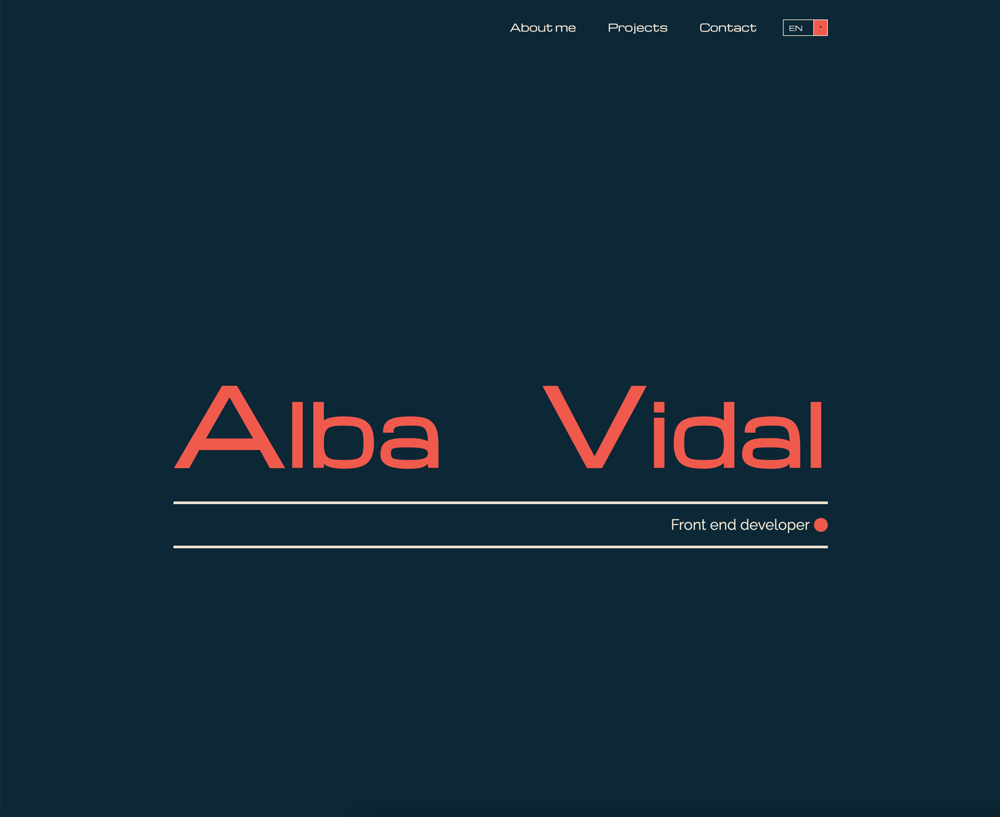

# 📓 My portfolio

Here you have my portfolio built in React. You could know a little bit more about me, download my resume, see some of my projects and contact with me through a form or my social network.
Welcome on board!

## Table of contents

- [Overview](#overview)
  - [Screenshots](#screenshots)
  - [Links](#links)
  - [Further implementations](#further-implementations)
- [My process](#my-process)
  - [Built with](#built-with)
  - [Setup](#setup)
  - [What I learned](#what-i-learned)
- [Author](#author)

## Overview

### Screenshots



### Links

- Code: [https://github.dev/albavidalm/portfolio/](https://github.dev/albavidalm/portfolio)

- Live: [https://albavidalm.github.io/portfolio/](https://albavidalm.github.io/portfolio)

### Further implementations

Soon I will add a button to toggle the portfolio in Dark or Light mode.
I also want to implement a functionality to switch between English and Spanish.

## My process

### Built with

- HTML5
- CSS3
- Grid
- Sass
- React
- React Hook Form
- EmailJS
- Responsive

### Setup

- Once you've download or cloned the project, install it with:
  ```bash
  npm install
  ```
- After that, if you want to run it in local execute this command:
  ```bash
  npm start
  ```

### What I learned

I extended my CSS and Sass knowledge plus was the first time I used EmailJs.

## Author

- GitHub: [https://github.com/albavidalm](https://github.com/albavidalm)
- Email: [albavidalm @ gmail.com](mailto:albavidalm@gmail.com?subject=Hi)
- Linkedin: [https://www.linkedin.com/in/albavidalm/](https://www.linkedin.com/in/albavidalm/)

## 🖤 Support

Sharing is caring, contributions, PR and suggestions are always welcome.
